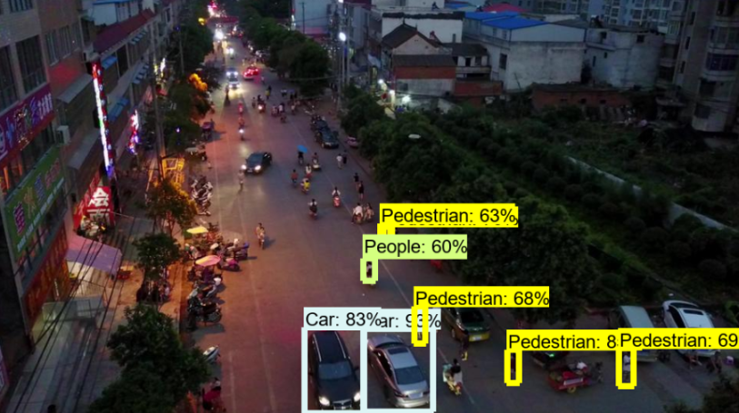

# drone-image-classification

Developed with @KKyleK (https://github.com/KKyleK).

A convolutional neural network for detecting classifying objects in a drone image from the VisDrone dataset. The CNN is trained based on an annotations file containing the bounding boxes for each labeled subject in the drone image.

These include:
- pedestrian 
- people
- bicycle
- car
- van
- truck
- tricycle
- awning-tricycle
- bus
- motor
- others.

## Results

Results compared to Faster-RCNN-InceptionV3 trained on the same dataset:

Source - (https://github.com/dronefreak/VisDrone-dataset-python-toolkit)

Image Classification CNN  |  Faster-RCNN-InceptionV3
:--------------:|:-------------------------:
      |  
      |  
